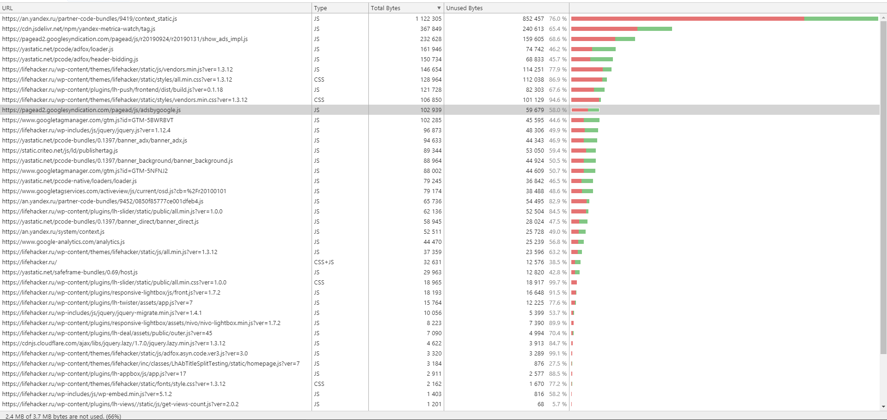

# Анализ вкладки "Coverage"

1. Скриншот вкладки после загрузки страницы:

1. Объем неиспользованного CSS
По данным таблицы на скриншоте: 229 КБ.

1. Объем неиспользованного JS
По данным таблицы на скриншоте: 2236 КБ.

1. Для ссылки https://lifehacker.ru/ указан тип данных CSS+JS.
Объем неиспользованных данных смешанного типа 12 КБ.

Дополнительно:
Сделал экспорт данных таблицы (приложил файл `Coverage-20190928TO82521.json`) и попробовал использовать данные из него для подсчета.  
По какой-то причине, суммы байт, указанные в таблице, и те, что получились на основе Coverage.json, у меня не сошлись. 
В большинстве случаев общий объем совпадал, а число неиспользованных данных - нет. 
Код, который я использовал для анализа данных, прилагаю в файле coverage_calc.js. 

Запускать командой `(NodeJS v10)`
~~~
node coverage_calc.js
~~~
На основании coverage.json получилась следующая статистика по объему неиспользованного кода:
* JS: 1985 КБ
* CSS: 228 КБ
* Неопределенный тип (https://lifehacker.ru/): 457 КБ

Если у проверяющих есть информация о причинах такого несовпадения статистики, был бы рад узнать о ней.