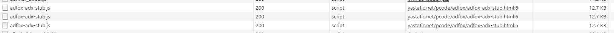

# Анализ вкладки "Network"

## Неоптимальные места

### Дублирование ресурсов
1. show_ads_impl.js

1. adsbygoogle.js

1. osd.js

1. adfox-adx-stub.js

1. При скролле большинство картинок подгружается заново

### Лишний размер ресурса
1. Картинка весит 410 KB, при этом является частью небольшого небольшого баннера.

### Медленно загружающиеся ресурсы
1. У всех файлов на картинке время ожидания начала (FTTB) загрузки более 500 мс

1. Ресурсы на картинке загружались дольше всех (все более 900 мс), 1й файл почти 6 секунд.

### Ресурсы, блокирующие загрузку
1. Загрузка ресурсов заблокирована из-за протокола HTTP/1.1 и/или наличия более приоритетных запросов

